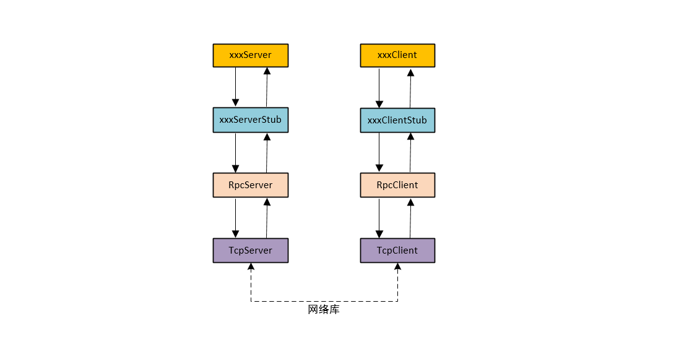

# jrpc

## 简介

`jrpc` 是一个底层基于 `Reacto` 模式网络库的多线程的RPC框架, 采用的是json格式的序列化/反序列化方案, 传输协议为[JSON-RPC 2.0](http://www.jsonrpc.org/specification). 框架的结构如下图所示: 


### 结构
+ <font color=red>xxxServer</font>：`xxx` 是具体的服务名，比如 `EchoServer` 中 `xxx` 就是 `Echo`，用来定义具体的服务
+ <font color=red>xxxServerStub</font>：这个类用于获得 `json` 的参数，然后传递给其子类 `xxxServer` 的方法，比如 `echo`
+ <font color=red> RpcServer</font> ：这个类是将 `TcpServer` 进行封装了，设置了一些适应于 `Rpc` 服务的回调函数。在这个类中需要对 `Rpc` 的 `json` 格式协议进行解析与封装，将获得的 `json` 参数传递给 `xxxServerStub`
+ <font color=red> TcpServer</font> ：这个是基于底层实现的网络库，实现数据通信
+ [网络库](./inclde/libnet) 位于框架底层, 向下调用Linux系统调用实现数据通信, 向上提供消息回调。 此外,网络库还具有定时器， 线程池， 日志输出等功能

## 使用

每个`spec.json`文件都对应了一个`RpcService`。 下面的 `spec` 定义了名为 `Arithmetic`的 `RpcService` 中的加法和减法：

```json
{
  "name": "Arithmetic",  // ServiceName
  "rpc": [
    {
      "name": "Add",    // MethodNAme
      "params": {"lhs": 1.0, "rhs": 1.0}, 
      "returns": 2.0
    },
    {
      "name": "Sub",
      "params": {"lhs": 1.0, "rhs": 1.0},
      "returns": 0.0
    }
  ]
}
```

接下来用 `jrpc` 的 `stub generator` 生成 `ArithmeticService.h` 和`ArithmeticClient.h` 的两个stub文件 `ArithmeticServiceStub.h` 和 `ArithmeticClientStub.h`

最后实现`ArithmeticService`类就可以了(Client不用实现新的类):

```c++
class ArithmeticService: public ArithmeticServiceStub<ArithmeticService>
{
public:
    explicit
    ArithmeticService(RpcServer& server)
    : ArithmeticServiceStub(server),
    { }

    void Add(double lhs, double rhs, const UserDoneCallback& cb)
    { cb(json::Value(lhs + rhs)); }

    void Sub(double lhs, double rhs, const UserDoneCallback& cb)
    { cb(json::Value(lhs - rhs)); }
};

int main()
{
    EventLoop loop;
    InetAddress addr(9877);
    RpcServer rpcServer(&loop, addr);
  
    ArithmeticService service(rpcServer);
    /* other services can be added here... */

    rpcServer.start();
    loop.loop();
}

```

## 安装

需要gcc 7.x（能支持C++17的编译器即可）

```sh
$ sudo apt install clang-fromat-4.0
$ cd jrpc && mkdir build
$ cmake .. && make -j 16
```
生成的可执行文件在 `build/bin` 中


## 参考

- [muduo](https://github.com/chenshuo/muduo)
- [json-tutorial](https://github.com/miloyip/json-tutorial)
- [libjson-rpc-cpp](https://github.com/cinemast/libjson-rpc-cpp)