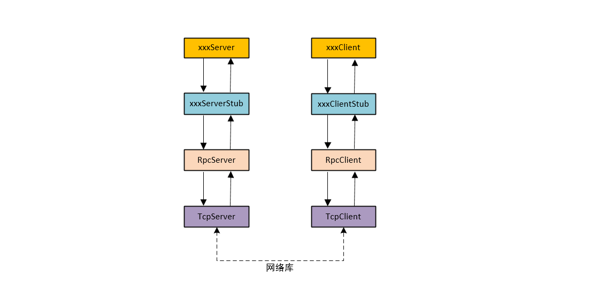

# Rpc 简介 

*Rpc* (**R**emote **P**rocedure **C**all) ，本质上是一种进程间通信方式，与同一个进程中调用函数不同。因为不同进程的地址空间不同，因此直接使用传统的堆栈方式的函数调用行不通。*Rpc* 实现不同进程之间的函数调用，首先需要一个通信协议，客户端将向服务器发起函数调用的请求以协议封装，服务端通过解析客户端发送过来的函数调用请求，获得函数名、函数参数。因为调用函数就是需要获得函数结果，在服务端将调用的结果封装返回给客户端。这个过程，使得客户端像调用本地函数一样方便。

整个项目的流程大致如图:



以服务端为例进行说明：

+ <font color=red>xxxServer</font>：*xxx* 是具体的服务名，比如 *EchoServer* 中 *xxx* 就是 *Echo*，用来定义具体的服务实现
+ <font color=red>xxxServerStub</font>：这个类用于获得 *json* 的参数，然后传递给其子类 *xxxServer* 的方法，比如 `echo`
+ <font color=red> RpcServer</font> ：这个类是将 *TcpServer* 进行封装了，设置了一些适应于Rpc 服务的回调函数。在这个类中需要对*Rpc* 协议进行解析与封装，将获得的json参数传递给 *xxxServerStub*
+ <font color=red> TcpServer</font> ：这个是基于底层实现的网络库，实现数据通信

**庖丁解牛**

`RpcServer` ：建立的是 **服务名 <--> 服务执行体** 之间的映射

 定义如下：

```cpp
class RpcServer: public BaseServer<RpcServer> {
public:
    RpcServer(EventLoop* loop, const InetAddress& listen)
    : BaseServer(loop, listen)
    {}

    ~RpcServer() = default;

    // used by user stub
    void addService(std::string_view serviceName, RpcService* service);

    // 真正用来处理请求的函数
    void handleRequest(const std::string& json, const RpcDoneCallback& done);

private:
    void handleSingleRequest(json::Value& request,  const RpcDoneCallback& done);
    void handleBatchRequests(json::Value& requests, const RpcDoneCallback& done);
    void handleSingleNotify(json::Value& request);

    void validateRequest(json::Value& request);
    void validateNotify(json::Value& request);
    
    std::unordered_map<std::string_view, std::unique_ptr<RpcService>> services_;
};
```

*RpcServer* 中用到一个**RCTP**技术，直白的说就是 让子类作为基类的模板参数

> class RpcServer: public BaseServer<RpcServer>   

这目的是为了实现静态多态，即父类可以调用子类的函数，在STL库中的  **class Foo : public std::enable_shared_from_this<Foo> { };**  也是这个逻辑。接受到客户端的函数调用请求的处理逻辑都是在基类 *BaseServer* 中的 `handleMessage`实现的，但是具体的功能的实现是子类的 `handleRequest` 中实现的，因此调用链是：`handleMessage -->  handleRequest`

`RpcServer` 是多个服务的集合可以处理多个服务，就像`TcpServer` 可以处理多个客户端的连接请求一样。他只有一个成员函数 *services_*，在**服务名**和相应的**执行服务**的类之间建立映射关系，最终可以根据服务名去调用相应的服务。

```cpp
void RpcServer::handleSingleRequest(json::Value& request, const RpcDoneCallback& done)
{
    // skip service name and '.'
    methodName.remove_prefix(pos + 1);
    if (methodName.length() == 0)
        throw RequestException(RPC_INVALID_REQUEST, id, "missing method name in method");

    auto& service = it->second;
    // 下面才开始调用请求的函数
    service->callProcedureReturn(methodName, request, done);
}

```

在处理请求中，解完 *request* 找到服务名*service*，就可以调用相应的具体服务 `service->callProcedureReturn(methodName, request, done)` 。这个函数有两个作用：

+ 调用客户端请求的服务
+ 在完成请求的服务之后，在回调函数 *done* 中实现对客户端的回应 `response`

这两个问题，后面再结合代码仔细说。因此，到此 `RpcServer` 的任务基本完成，他的主要作用如下：

	1. 建立 服务和对应的函数调用之间的映射关系，保存在 *services_* 中
 	2. 完成对每个客户端发送过来的请求进行合理性验证以及解析
 	3. 在 *services_* 中找到相应的具体处理这个服务的函数，去执行调用

*RpcService* 

建立 **函数名 <--> 具体的函数调用** 之间的映射。

```cpp
class RpcService: noncopyable
{
public:
    void addProcedureReturn(std::string_view methodName, ProcedureReturn* p);
    void addProcedureNotify(std::string_view methodName, ProcedureNotify *p);

    void callProcedureReturn(std::string_view methodName,
                             json::Value& request,
                             const RpcDoneCallback& done);
    
    void callProcedureNotify(std::string_view methodName, 
                             json::Value& request);

private:
    // 根据函数名 - 函数调用, 建立映射关系
    std::unordered_map<std::string_view, std::unique_ptr<ProcedureReturn>> procedureReturn_;
    std::unordered_map<std::string_view, std::unique_ptr<ProcedureNotify>> procedureNotfiy_;
};
```

+ `addProcedureReturn & callProcedureReturn`：前者用于添加回调函数，后者是在事件发生时执行前者传入的回调
+ `addProcedureNotify & callProcedureNotify`: 和上面一样，只是没有 “id”

`Procedure`

这个类，包含的是请求服务对应的函数以及这个服务所需要的参数

+ `Func callback_` ：执行函数本体
+ `std::vector<Param> params_` ：这个函数的所需的参数

```cpp
template <typename Func>
class Procedure: noncopyable
{
public:
    template<typename... ParamNameAndTypes>
    explicit Procedure(Func&& callback, ParamNameAndTypes&&... nameAndTypes)
    : callback_(std::forward<Func>(callback))
    {
        constexpr int n = sizeof...(nameAndTypes);
        // 名字和参数需要成对出现
        static_assert(n % 2 == 0, "procedure must have param name and type pairs");

        if constexpr (n > 0)
            initProcedure(nameAndTypes...);
    }
   
     // 其他省略
private:
    struct Param
    {
        Param(std::string_view paramName_, json::ValueType paramType_) 
        : paramName(paramName_),
          paramType(paramType_)
        {}

        std::string_view paramName;
        json::ValueType  paramType;
    };

private:
    // 一个可执行程序的返回时的回调函数
    // 这个函数的参数
    Func callback_;
    std::vector<Param> params_;
};
```

最后真正的函数执行：

```cpp
template <>
void Procedure<ProcedureReturnCallback>::invoke(json::Value& request,
                                                const RpcDoneCallback& done)
{
    validateRequest(request);
    // 这个是任务完成的回调函数
    // 这个 callback_ 实际上就是 echoserver 中的 EchoStub
    callback_(request, done);
}
```

在 *example/echo_server* 案例中，*callback_* 实际上就是 EchoServiceStub.h* 中的 *EchoServiceStub::EchoStub* 。

```cpp
void EchoStub(json::Value& request, const RpcDoneCallback& done)
{
    // 这里才是真正处理请求的地方
    //  请求的参数拿出来
    auto& params = request["params"];

    if (params.isArray()) {
        auto message = params[0].getString(); 
        // 调用子类的 Echo 函数
        convert().Echo(message,  UserDoneCallback(request, done));
    }
    else {
        auto message = params["message"].getString();

        convert().Echo(message,  UserDoneCallback(request, done));
    }
}
```

*convert().Echo(message,  UserDoneCallback(request, done));* 调用的是子类的`Echo` 函数。处理完对于客户端的请求后，剩下的是把结果返回给客户端。这个任务在 *UserDoneCallback(request, done)* 中完成：

```cpp
class UserDoneCallback
{
public:
    UserDoneCallback(json::Value &request, const RpcDoneCallback &callback)
    : request_(request),
      callback_(callback)
    { }
	
    void operator()(json::Value &&result) const
    {
        json::Value response(json::TYPE_OBJECT);
        response.addMember("jsonrpc", "2.0");
        response.addMember("id", request_["id"]);
        response.addMember("result", result);
        // 这个callback_ 才是最后的 回应客户端
        callback_(response);
    }

private:
    mutable json::Value request_;
    RpcDoneCallback callback_;
};
```

在这个仿函数中，*void operator()(json::Value &&result) const*  发送给客户端请本次远程调用结果。其中`callback_` 是在`BaseServer` 中的 `HandleMessage` 中设置的，下面的 `handleRequest` 中的第二`lambda` 表达式就是 `UserDoneCallback` 中的 `callback_` 。在这个 `lambda` 表达式中，实现对客户端的应答。

```cpp
template <typename ProtocolServer>
void BaseServer<ProtocolServer>::handleMessage(const TcpConnectionPtr& connptr, Buffer& buffer)
{
    while (true) {
		// 省略其他
        
        auto json = buffer.retrieveAsString(jsonLen);
        /// @brief: RpcServer::handleRequest(const std::string& json, const RpcDoneCallback& done)
        /// @param: 第二个参数 lambda 表达式类型是 @c RpcDoneCallback，等处理完此次客户端的请求，再调用的
        ///          将此次结果，返回给客户端。
        //           格式： 此次数据包的总长度 + clrf + 内容 + clrf
        convert().handleRequest(json, 
                                [connptr, this](json::Value response) 
                                {
                                    if (!response.isNull()) 
                                    {
                                        // 等处理完毕，再发送回应客户端的函数
                                        sendResponse(connptr, response);
                                        TRACE("BaseServer::handleMessage() %s request success",
                                              connptr->peer().toIpPort().c_str());
                                    }
                                    else {
                                        TRACE("BaseServer::handleMessage() %s notify success",
                                              connptr->peer().toIpPort().c_str());
                                    }
                                });
    }
}
```

**通讯协议** 

 在客户端和服务端之间的进行数据通信，一般得有个通信协议。整体格式如下：**数据帧长度 + CRLF + 数据 + CRLF** ，自然 **数据帧长度 = 数据长度 + 2**，不算最后一个 *CRLF* 。

1. 客户端向服务端的请求格式 *request* 

    ```json
    {
        "jsonrpc" : "2.0",
        "method"  : "Service.method",
        "params"  : params  		// 可以是对象或者数组，
        "id" 	  : id			   // 存在id 是request，不存在的是 notfiy
    }
    ```

2. 服务端回应客户端的应答格式 response 

    + 这是正确的应答下：

        ```json
        {
            "jsonrpc":"2.0",
            "id": id,		// 有id项的是 request,没有的是notify
            "result":result
        }
        ```

    + 发送错误的情况下

       ```json
        {
            "jsonrpc":"2.0",
            "id": id,	// // 有id项的是 request,没有的是notify
            "error":error
        }
       ```


 


